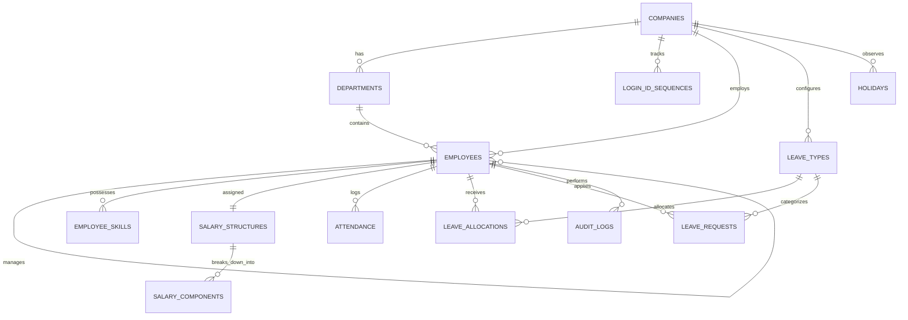

# Dayflow HRMS Backend

Production-grade, clean-architecture backend for **Dayflow** (Human Resource Management System) built with Node.js 20+, Express 4, ES Modules, MySQL 8 (`mysql2/promise` connection pool), raw parameterized SQL, JSDoc annotations, Zod validation, and Dependency Injection.

---

## 1. Quickstart (Under 5 Commands)

```bash
# 1. Install dependencies
npm install

# 2. Copy and configure environment variables
cp .env.example .env

# 3. Create database and run migrations
npm run db:setup

# 4. Populate idempotent demo seed data
npm run db:seed

# 5. Start development server
npm run dev
```

Server starts at: `http://localhost:5000` (API base: `http://localhost:5000/api`)

---

## 2. Architecture & Layering

Dayflow follows a strict **four-layer unidirectional flow**:

```
HTTP Request  --?  Route  --?  Controller  --?  Service  --?  Repository  --?  MySQL 8
```

- **Route (`*.routes.js`)**: Defines URL paths, middleware chains (auth, rate limiting, multer), and Zod validation schemas. Contains zero business logic.
- **Controller (`*Controller.js`)**: Subclasses `BaseController`. Parses HTTP request parameters, invokes a single service method, and formats responses via `ApiResponse`. Never touches SQL directly.
- **Service (`*Service.js`)**: Subclasses `BaseService`. Implements business rules, transaction orchestration, and validations. Completely decoupled from HTTP `req` / `res`.
- **Repository (`*Repository.js`)**: Subclasses `BaseRepository`. Encapsulates all raw SQL queries with parameterization. Converts `snake_case` database rows to `camelCase` domain objects. Never selects or exposes `password_hash`.
- **Dependency Injection (`src/container.js`)**: Uses constructor injection to wire databases, repositories, services, and controllers without singletons or `new` instantiation in business layers. This provides testability and modularity.

---

## 3. Database Entity-Relationship Diagram



---

## 4. Demo Seed Credentials

All seeded accounts use password: **`Password@123`**

| Role | Login ID | Email | Name | Department |
|---|---|---|---|---|
| **Admin** | `OIADSH20220001` | `amit.sharma@odooindia.com` | Amit Sharma | Management / Engineering |
| **HR** | `OIPRSH20230001` | `priya.sharma@odooindia.com` | Priya Sharma | Human Resources |
| **Employee** | `OIRAVE20230002` | `rahul.verma@odooindia.com` | Rahul Verma | Engineering |
| **Employee** | `OIANKA20240001` | `ananya.kapoor@odooindia.com` | Ananya Kapoor | Engineering |
| **Employee** | `OIVIRA20240002` | `vikram.rao@odooindia.com` | Vikram Rao | Sales |
| **Employee** | `OINEGU20240003` | `neha.gupta@odooindia.com` | Neha Gupta | Sales |
| **Employee** | `OISYME20240004` | `sameer.mehta@odooindia.com` | Sameer Mehta | Finance |
| **Employee** | `OIPODE20240005` | `pooja.deshmukh@odooindia.com` | Pooja Deshmukh | Engineering |

---

## 5. API Endpoints Reference

Base Path: `/api`

| Method | Endpoint | Access | Description |
|---|---|---|---|
| `GET` | `/health` | Public | System status, uptime, and MySQL pool metrics |
| `POST` | `/auth/register-company` | Public | Registers company & bootstraps initial Admin |
| `POST` | `/auth/login` | Public (Rate-limited) | Login using Login ID or Email |
| `GET` | `/auth/me` | Authenticated | Current user profile and role permissions |
| `POST` | `/auth/change-password` | Authenticated | Updates password & clears must-change flag |
| `POST` | `/auth/logout` | Authenticated | Revokes session |
| `GET` | `/employees` | Authenticated | Card grid with resolved `todayStatus` (No N+1) |
| `POST` | `/employees` | Admin, HR | Creates employee, returns temp password once |
| `GET` | `/employees/me` | Authenticated | Own comprehensive profile |
| `GET` | `/employees/:id` | Authenticated | Employee view-only profile (salary omitted) |
| `PATCH` | `/employees/:id` | Self (limited) / Admin | Updates profile fields |
| `POST` | `/employees/:id/avatar` | Self, Admin | Uploads profile picture (<=2MB JPEG/PNG/WebP) |
| `POST` | `/employees/:id/skills` | Self, Admin | Adds skill or certification |
| `DELETE`| `/employees/:id/skills/:skillId` | Self, Admin | Removes skill or certification |
| `GET` | `/departments` | Authenticated | Company department roster |
| `POST` | `/departments` | Admin, HR | Creates new department |
| `GET` | `/attendance/status` | Authenticated | Systray widget (`checkedIn`, `since`, `todayStatus`) |
| `POST` | `/attendance/check-in` | Authenticated | Daily attendance check-in |
| `POST` | `/attendance/check-out` | Authenticated | Daily check-out with work/extra hours calculation |
| `GET` | `/attendance/me?month=YYYY-MM` | Authenticated | Employee monthly attendance and payable days |
| `GET` | `/attendance?date=YYYY-MM-DD` | Admin, HR | Company-wide daily attendance list |
| `GET` | `/leave-types` | Authenticated | Available company leave types |
| `GET` | `/leaves/allocations/me` | Authenticated | Employee leave balance cards |
| `POST` | `/leaves/allocations` | Admin, HR | Upserts yearly leave allocation |
| `GET` | `/leaves?scope=me\|all&status=`| Authenticated / Admin, HR | Filterable leave requests list |
| `POST` | `/leaves` | Authenticated | Submits leave request (multipart with attachment) |
| `PATCH`| `/leaves/:id/status` | Admin, HR | Approves / rejects request with concurrency lock |
| `DELETE`| `/leaves/:id` | Own Pending Only | Cancels pending leave request |
| `GET` | `/leaves/calendar?year=YYYY` | Authenticated | Full year calendar of leaves and holidays |
| `GET` | `/holidays` | Authenticated | Company observed holidays |
| `POST` | `/holidays` | Admin, HR | Registers new public holiday |
| `GET` | `/employees/:id/salary` | **Admin Only** | Salary structure & computed breakdown |
| `PUT` | `/employees/:id/salary` | **Admin Only** | Recomputes & updates salary components |
| `GET` | `/employees/:id/payslip?month=YYYY-MM` | Admin, Self | Prorated monthly payslip using `payableDays` |

---

## 6. Key Design Decisions

### 6.1 Concurrency Control & Row-Level Locking
- **Login ID Sequences**: Concurrency-safe generation uses `INSERT INTO login_id_sequences (company_id, join_year, last_serial) VALUES (?, ?, 1) ON DUPLICATE KEY UPDATE last_serial = last_serial + 1` combined with `SELECT ... FOR UPDATE` inside the employee creation transaction.
- **Leave Approval Workflow**: `PATCH /leaves/:id/status` acquires a row lock (`SELECT ... FOR UPDATE`) on the target request to prevent race conditions (double approvals or over-decrementing balances). The transaction updates status, increments used allocation days, upserts attendance records, and logs an audit entry atomically.

### 6.2 Zero N+1 Querying (`todayStatus`)
Employee card listing resolves `todayStatus` (`on_leave` > `present` > `absent`) in a single query via `LEFT JOIN` on `leave_requests` and `attendance`:
```sql
SELECT 
  t.*, d.name AS department_name,
  CASE
    WHEN lr.id IS NOT NULL THEN 'on_leave'
    WHEN a.check_in IS NOT NULL THEN 'present'
    ELSE 'absent'
  END AS today_status
FROM employees t
LEFT JOIN departments d ON d.id = t.department_id
LEFT JOIN leave_requests lr ON lr.employee_id = t.id AND lr.status = 'approved' AND ? BETWEEN lr.start_date AND lr.end_date
LEFT JOIN attendance a ON a.employee_id = t.id AND a.work_date = ?
WHERE t.company_id = ?
ORDER BY t.id DESC LIMIT ? OFFSET ?;
```

### 6.3 Salary Precision & Invariant Guarantee
The `SalaryCalculator` is a pure, database-agnostic class. To eliminate rounding drift across fractional percentage calculations, the **Fixed Allowance** component acts as an exact remainder:
$$\text{Fixed Allowance} = \text{Monthly Wage} - \sum(\text{Other Earnings})$$
An invariant assertion validates that $\sum \text{Earnings} \equiv \text{Monthly Wage}$ to the cent.
*(Note: The wireframe notes 2918.00 for ?50,000 wage, but the written spec — remainder absorption — is strictly enforced in code).*

### 6.4 Security & Scoping
- Multi-tenancy: Every query is parameterized and strictly scoped by `company_id`.
- `password_hash` is stripped by default at the repository layer and is never returned in queries or API payloads.
- `requirePasswordChanged` middleware intercepts non-exempt routes when `must_change_password === 1`.
